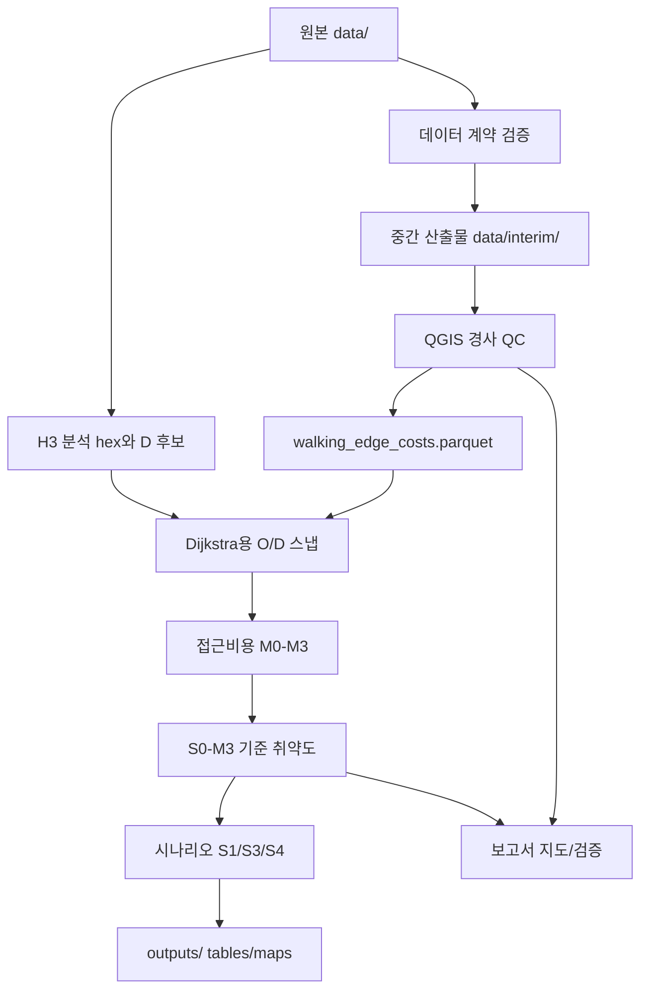

# 프로젝트 구조도

## 전체 구조

```text
SL 프로젝트/
├─ AGENTS.md                       # Codex/GPT 작업 지침
├─ configs/                         # 경로, 데이터 소스, 모형 파라미터
│  ├─ default.yaml
│  ├─ data_sources.yaml
│  └─ model_params.yaml
├─ data/                            # 원본 데이터 위치, 직접 수정 금지
│  ├─ 250_LOCAL_RESD_202511/
│  ├─ walking_network_edges_with_slope_google.csv
│  ├─ walking_network_nodes_with_elevation.csv
│  ├─ bus_stop_ridership_2025_with_geom.csv
│  ├─ subway_station_ridership_2025_with_geom.csv
│  └─ OBS_ASOS_TIM_20260510220825.csv
├─ data/interim/                    # 중간 산출물, git 제외, 예: walking_edge_costs.parquet
├─ data/processed/                  # 정제 산출물, git 제외
├─ src/sl_accessibility/            # Python 하네스
│  ├─ io/                           # 안전한 CSV reader
│  ├─ data/                         # 데이터 계약과 검증
│  ├─ geo/                          # 보행망/공간 처리
│  ├─ weather/                      # ASOS 정규화와 기상 비용
│  ├─ transit/                      # 정류장/승하차 처리
│  ├─ population/                   # 생활인구/생활이동 처리
│  ├─ poi/                          # 시설 POI 정규화
│  └─ accessibility/                # 비용함수, 정규화, 평가 지표
├─ scripts/                         # 실행용 얇은 wrapper
├─ tests/                           # 단위 테스트
├─ docs/                            # 사람이 읽는 작업 문서
│  ├─ qgis/                         # QGIS 수동 작업 매뉴얼
│  ├─ methods/                      # 방법론/계수 해석
│  └─ setup/                        # 환경 설정
├─ qgis/                            # QGIS 프로젝트, H3 hex/D 후보, 스타일, QA, export
├─ outputs/                         # 보고서/표/지도 산출물, git 제외
└─ skills/                          # repo-local Codex 스킬
```

## 데이터 흐름



현재 주요 하네스 산출물은 다음이다.

```text
data/interim/walking_edge_costs.parquet
qgis/out_analysis_hex_h3res9.gpkg
qgis/out_transit_d_candidates.gpkg
```

전체 walking edges CSV는 lazy 방식으로 읽고, QGIS QC 기준(`>100%` 제외, `30~100%` 30% cap)을 비용 계산에 반영한다. H3 분석 hex와 대중교통 D 후보는 QGIS에서 검수한 뒤 Dijkstra용 O/D 스냅으로 넘어간다.

## 기준선 역할

| 기준 | 역할 | 사용 위치 |
|---|---|---|
| `M0` | 거리만 반영한 현행 기준 비교 | Measurement gap, hidden area 탐지 |
| `M3` | 거리, 경사, 기상 상호작용 반영 | 실제 취약성 계산 |
| `S0-M3` | 현재 상태의 주 기준선 | 모든 정책 시나리오 평가 |

시나리오별로 Min-Max 정규화를 다시 하면 비교가 깨진다. 따라서 `S0-M3`에서 정한 정규화 기준과 취약 threshold를 모든 시나리오에 고정 적용한다.

## 작업 책임

| 영역 | 위치 | 목적 |
|---|---|---|
| Python 하네스 | `src/sl_accessibility/` | 반복 가능한 계산과 검증 |
| QGIS 작업 | `docs/qgis/`, `qgis/` | 마스크, 격자, 경사, 지도 수동 검수 |
| 연구 문서 | `docs/methods/` | 계수, 방법론, 해석 한계 정리 |
| Codex/GPT 지침 | `AGENTS.md` | 프로젝트를 열 때 가장 먼저 적용할 공통 작업 규칙 |
| 프로젝트 스킬 | `skills/` | Codex가 다음 작업에서 같은 규칙을 기억하도록 하는 repo-local 지침 |
