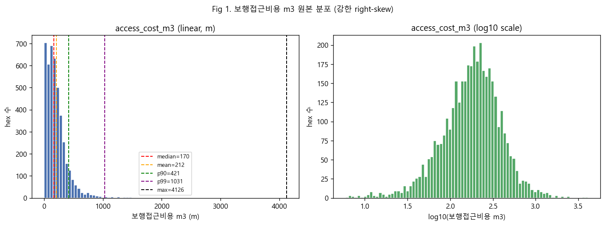
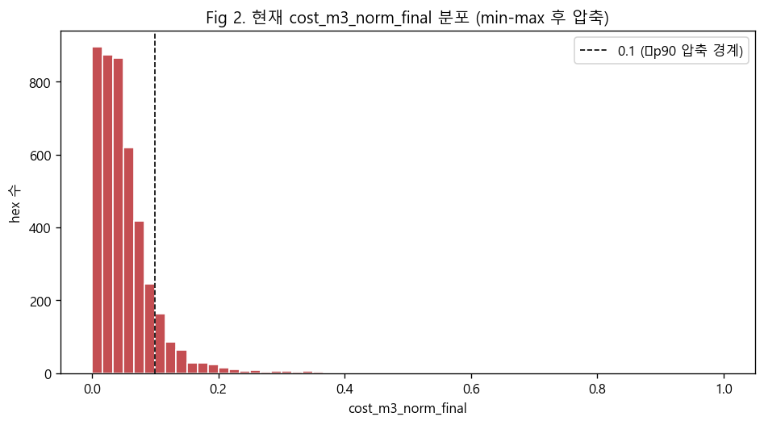
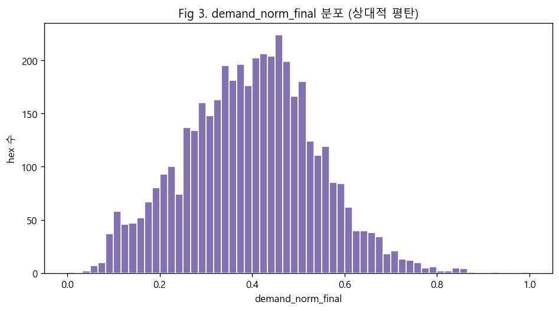
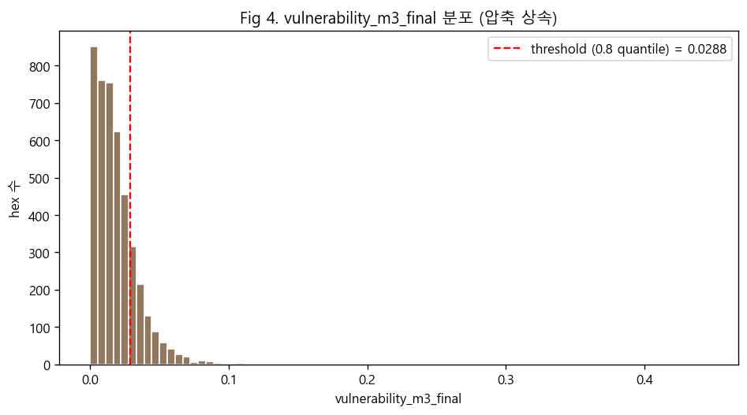
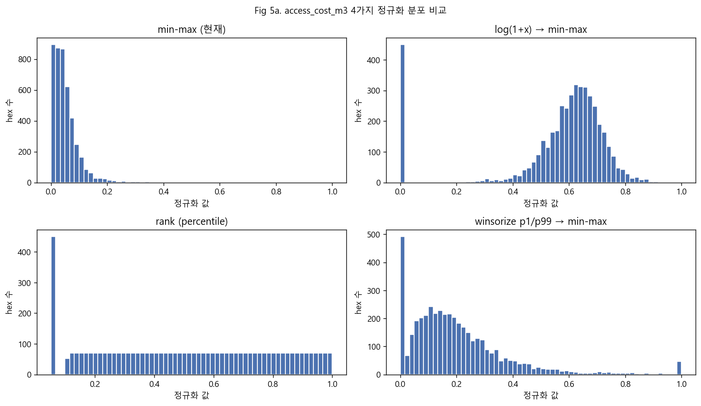
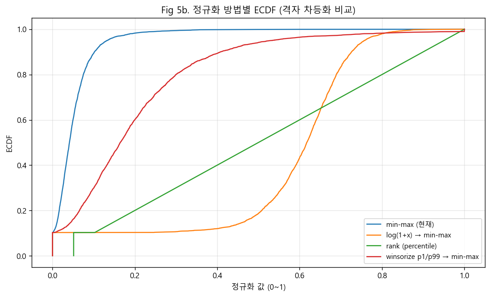
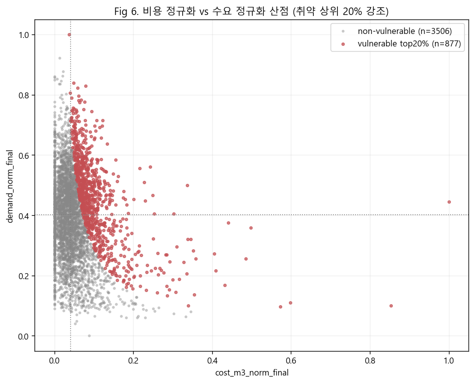

# 04. 분포 및 정규화 대안 시각화 (팀원4)

**데이터**: `data/derived/hex_vulnerability_final.parquet`, analysis_valid_final=True (n=4,383)
**그림 위치**: `outputs/figures/critique/*.png`
**표 원본**: `outputs/reports/critique/_T1_norm_distribution.csv`, `_T2_vulnerable_alt_methods.csv`

---

## Fig 1. 보행접근비용 m3 원본 분포 (linear + log10)

- median 169.8m, mean 212.3m, p99 1,028m, max **4,126m**
- max/median ≈ 24배 → 강한 right-skew. linear panel에서는 0~400m 좁은 구간에 대부분 hex가 몰리고 long tail이 우측으로 길게 뻗음.
- log10 panel에서는 분포가 거의 종형에 가까워짐 → log 변환의 효과를 시각적으로 입증.

## Fig 2. 현재 cost_m3_norm_final 분포 (min-max 정규화 후)

- 90% hex가 [0, 0.1] 구간에 압축. raw 분포의 right-skew를 그대로 상속하지만, max 한 hex가 1.0을 강제로 끌어당겨 나머지가 작은 값에 짓눌림.
- 격자 간 차등 신호가 매우 약함 (격자 대부분이 거의 같은 점수).

## Fig 3. demand_norm_final 분포 (비교 대조)

- median 0.40, 분포가 종형에 가까워 격자 차등화 양호.
- 곱셈 모델에서 demand 쪽은 잘 펼쳐졌는데 cost는 압축돼 있으므로, 두 차원의 영향력이 비대칭. 결과적으로 vulnerability 점수는 demand가 아니라 **cost의 극단 outlier**에 의해 max가 결정됨.

## Fig 4. vulnerability_m3_final 분포 + threshold

- threshold = 0.0288 (0.8 분위, 빨간 점선). vulnerable hex 877개.
- 분포는 cost의 압축을 상속해 median 0.0154에 몰림. threshold 근처에 hex가 빽빽이 놓여 있어 **작은 정규화 변동에도 vulnerable/not 경계가 흔들릴 위험**.

## Fig 5a. 4가지 정규화 분포 비교 (히스토그램)

## Fig 5b. 4가지 정규화 ECDF (격자 차등화 비교)

- **min-max (현재)**: ECDF가 좌측에 급격히 솟아 90%가 0.1 이하 — 압축.
- **log(1+x) → min-max**: ECDF가 전 구간에 고르게 펼쳐짐 (median 0.62).
- **rank (percentile)**: 정의상 균등분포 (median 0.50).
- **winsorize p1/p99 → min-max**: outlier cap 효과로 압축 완화 (median 0.16).

## Fig 6. cost_norm vs demand_norm 산점 (취약 상위 20% 강조)

- vulnerable hex(빨강)는 우상단으로 치우치되, 특히 **cost_norm이 매우 작은 영역에도 일부 분포**. 이는 demand_norm이 매우 큰 hex가 vulnerable로 잡혔다는 뜻 → cost 신호가 약해서 demand 단독으로 결정된 사례 존재 (곱셈 모델의 비대칭성 실증).
- 사분면 중심선(median, median) 기준으로 우상단에 vulnerable이 집중. 좌상단(demand 높음·cost 낮음) 일부 hex가 잘못 분류될 가능성.

---

## T1. 4가지 정규화 후 cost 분포 통계

| method | min | p10 | p25 | median | p75 | p90 | max |
|---|---:|---:|---:|---:|---:|---:|---:|
| min-max (현재) | 0.0000 | 0.0000 | 0.0208 | **0.0412** | 0.0678 | 0.1020 | 1.0000 |
| log(1+x) → min-max | 0.0000 | 0.0000 | 0.5363 | **0.6175** | 0.6772 | 0.7260 | 1.0000 |
| rank (percentile) | 0.0514 | 0.0514 | 0.2502 | **0.5001** | 0.7501 | 0.9000 | 1.0000 |
| winsorize p1/p99 → min-max | 0.0000 | 0.0000 | 0.0833 | **0.1646** | 0.2713 | 0.4080 | 1.0000 |

**해석**: 현재 방법은 median 0.04로 격자 차등화가 거의 없음. log 변환은 분포 전체를 활용(median 0.62). rank는 강제 균등(median 0.50). winsorize는 중간 정도 개선(median 0.16).

## T2. 정규화 변경 시 vulnerable 격자 변화 (demand_norm·threshold 동일)

| method | threshold(0.8q) | vulnerable_count | Jaccard vs 현재 |
|---|---:|---:|---:|
| min-max (현재) | 0.0288 | 877 | 1.0000 |
| log(1+x) → min-max | 0.3110 | 877 | **0.3965** |
| rank (percentile) | 0.2998 | 877 | **0.6996** |
| winsorize p1/p99 → min-max | 0.1152 | 877 | **0.9909** |

**핵심 발견**: 카운트(877)는 동일하지만(quantile 컷이므로), **어떤 hex가 vulnerable로 분류되는가는 크게 달라짐**.
- **log+min-max로 바꾸면 vulnerable hex의 60%가 교체됨** (Jaccard 0.40).
- 즉, 정규화 선택은 단순 시각화 차이가 아니라 **정책 타겟 격자가 바뀌는 결정**. 시나리오/정책 권고의 robustness 검증이 필수.

---

## 종합 시사점 (시각/표 기반)

1. raw 비용은 강한 right-skew, log 변환 시 종형에 근접 (Fig 1) → **log 후 정규화가 통계적 표준에 부합**.
2. 현재 min-max는 격자의 90%를 좁은 구간에 압축해 차등 신호를 잃음 (Fig 2, Fig 5).
3. 곱셈 모델에서 cost가 압축돼 있으므로 사실상 vulnerability ≈ small_cost_norm × demand_norm 형태가 됨. 이로 인해 demand가 큰 hex가 우선 잡힘 (Fig 6 좌상단 사례).
4. 정규화 선택은 정책 결정. **log 또는 winsorize 둘 중 하나로 변경 + 현행 결과와의 Jaccard 비교 보고**가 신뢰성 확보의 최소 조건.
